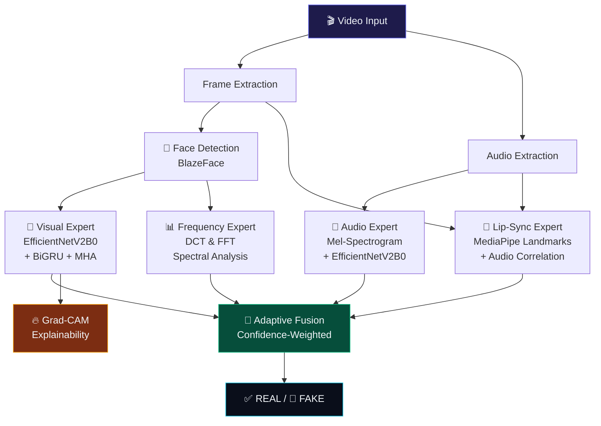

<div align="center">

# 🔬 VeriSync — Multi-Modal Deepfake Forensic Lab

### 🧠 AI-Powered Video Authenticity Verification System

[](https://python.org)
[](https://tensorflow.org)
[](https://streamlit.io)
[](LICENSE)

*A state-of-the-art multi-modal deepfake detection system that fuses **visual**, **audio**, **lip-sync**, and **frequency domain** forensic experts with confidence-weighted adaptive fusion and Grad-CAM explainability.*

---

</div>

## 🏗️ Architecture



## ✨ Key Features

| Feature | Description |
|---------|-------------|
| 🧠 **Visual Expert** | EfficientNetV2B0 backbone with BiGRU temporal modeling and Multi-Head Attention pooling — analyses face crops across 10 uniformly sampled frames |
| 🎵 **Audio Expert** | Mel-spectrogram analysis with pretrained CNN to detect synthesized/cloned speech |
| 👄 **Lip-Sync Analysis** | MediaPipe face landmark tracking correlated with audio energy envelope via lag-aware cross-correlation |
| 📊 **Frequency Forensics** | DCT energy distribution, 2D FFT azimuthal averaging, spectral flatness, and kurtosis analysis to detect GAN spectral fingerprints |
| 🔗 **Adaptive Fusion** | Confidence-weighted ensemble — each expert's contribution is dynamically scaled by its prediction entropy |
| 🔥 **Grad-CAM XAI** | Visual explanations highlighting facial regions the model considers most indicative of manipulation |
| 🖥️ **Forensic Dashboard** | Premium Streamlit UI with dark theme, animated gauges, interactive spectrograms, and exportable reports |

## 📂 Project Structure

```
VeriSync/
├── app.py                      # 🖥️  Streamlit forensic dashboard
├── model.py                    # 🧠  Visual expert architecture
├── model_audio.py              # 🎵  Audio expert architecture
├── lip_sync_analyzer.py        # 👄  Lip-sync analysis module
├── frequency_analyzer.py       # 📊  Frequency domain expert (DCT/FFT)
├── gradcam.py                  # 🔥  Grad-CAM explainability
├── data_loader.py              # 📦  Visual data pipeline
├── data_loader_audio.py        # 📦  Audio data pipeline
├── preprocess_utils.py         # 🔧  Face detection & mel-spectrogram extraction
├── train_visual.py             # 🏋️  Visual expert training
├── train_audio.py              # 🏋️  Audio expert training
├── calibrate_thresholds.py     # 🎯  Threshold calibration on val set
├── evaluate_full.py            # 📈  Full evaluation with visualizations
├── build_manifest.py           # 📋  Dataset manifest builder
├── prepare_splits.py           # ✂️  Leakage-safe split creation
├── tests/                      # 🧪  Unit tests & experiments
├── artifacts/                  # 🖼️  Visual outputs & logs
├── deprecated/                 # 💾  Old model formats (.h5)
├── .gitignore                  # 🚫  Git ignore rules
├── LICENSE                     # ⚖️  MIT License
├── requirements.txt            # 📦  Python dependencies
└── README.md                   # 📖  You are here
```

## 🚀 Quick Start

### 1. Setup Environment

```bash
python -m venv .venv
source .venv/bin/activate  # or .venv\Scripts\activate on Windows
pip install -r requirements.txt
```

### 2. Build Data Manifest

```bash
python build_manifest.py
```

### 3. Create Leakage-Safe Splits

```bash
python prepare_splits.py --manifest data_manifest.csv
```

### 4. Train Models

```bash
# Visual Expert
python train_visual.py --prepare-splits --epochs 20 --batch-size 8

# Audio Expert
python train_audio.py --prepare-splits --epochs 25 --batch-size 32
```

### 5. Calibrate Thresholds

```bash
python calibrate_thresholds.py
```

### 6. Launch Dashboard 🎉

```bash
streamlit run app.py
```

### CLI Inference

```bash
python deepfake_detector.py /path/to/video.mp4 --json-out report.json
```

## 📊 Evaluation

Generate full evaluation with publication-quality plots:

```bash
python evaluate_full.py --output-dir eval_results
```

This produces:
- **ROC curves** (per expert)
- **Precision-Recall curves** (per expert)
- **Confusion matrices** (styled)
- **Score distributions** (real vs. fake)
- **Per-manipulation-type accuracy** breakdown

## 🧪 Datasets

| Dataset | Modalities | Samples | Split |
|---------|-----------|---------|-------|
| **FaceForensics++ (C23)** | Video | ~5000 | StratifiedGroupKFold |
| **FakeAVCeleb** | Video + Audio | ~1000 | GroupShuffleSplit |

Splits are designed to be **leakage-safe** — no subject or source video appears in both training and validation sets.

## 🔬 Technical Deep-Dive

### Adaptive Fusion

Unlike simple weighted averaging, VeriSync uses **entropy-based confidence weighting**:

```
confidence(p) = 1 - H(p) = 1 - (-p·log₂(p) - (1-p)·log₂(1-p))
```

Each expert's contribution is proportional to its confidence — uncertain predictions are automatically downweighted. This prevents a single confused expert from corrupting the final verdict.

### Frequency Domain Analysis

GANs leave characteristic spectral fingerprints:
- **Suppressed high-frequency DCT energy** (blurring from upsampling)
- **Anomalous spectral flatness** (over-regularized textures)
- **Low kurtosis** in DCT coefficients (heavy-tailed → Gaussian shift)
- **Abnormal FFT radial roll-off** (periodic grid artifacts)

These features are combined into a heuristic anomaly score without requiring any neural network training.


---

<div align="center">

*VeriSync v2.0 — Seeing Through the Fake*

</div>
